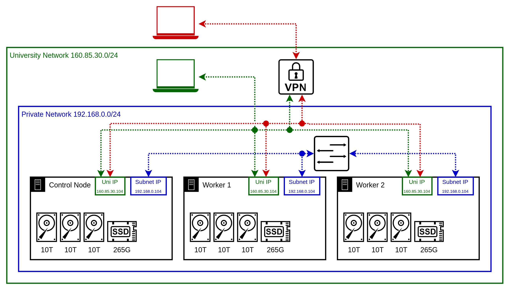

# Architecture and Design

## Overview of Test Environment
PowerStack runs on a Kubernetes cluster deployed across three identical bare-metal servers. These servers are located in a university data center and connected through both a private and university-managed network. This setup allows efficient workload execution while enabling complete remote management. 

### Physical Infrastructure

Each server features:
- **CPU**: Intel Xeon Bronze 3104, 6 cores
- **Memory**: 64GB DDR4 RAM
- **Storage**: SSD and HDD for persistent storage
- **Networking**: Private IPs for cluster-internal traffic, university network for external access

## Key Technologies
- **OS:** Ubuntu, chosen for familiarity and stability
- **Kubernetes Distribution:** K3s for a lightweight yet production-compatible cluster
- **Automation:** Ansible for infrastructure management, Helm for Kubernetes deployments
- **Monitoring:** Prometheus (metrics collection), Grafana (visualization), KEPLER (energy consumption tracking)

## Monitoring Stack & Data Flow
KEPLER collects energy metrics at both the container and node level. Prometheus scrapes these metrics and stores them as time series data, which is then visualized using Grafana dashboards.

### Data Flow

- **KEPLER:** Measures power consumption at the process, container, and node level
- **Prometheus:** Stores KEPLER’s metrics
- **Grafana:** Provides real-time visualization of power consumption trends

## Repository Structure
- `ansible/` – Playbooks for automated deployment
- `helm/` – Helm charts for Kubernetes services
- `scripts/` – Helper scripts for execution
- `config/` – Configuration and encrypted credentials
- `docs/` – Documentation for setup and architecture
- `thesis/` – Academic research materials related to the project

## Summary
PowerStack is designed to analyze energy efficiency in Kubernetes environments by integrating KEPLER with a fully automated, monitored, and optimized infrastructure. The modular repository structure allows easy deployment and adaptation for different hardware environments.

---
**Disclaimer**: This project is under active development. Features and configurations may change as improvements are made.